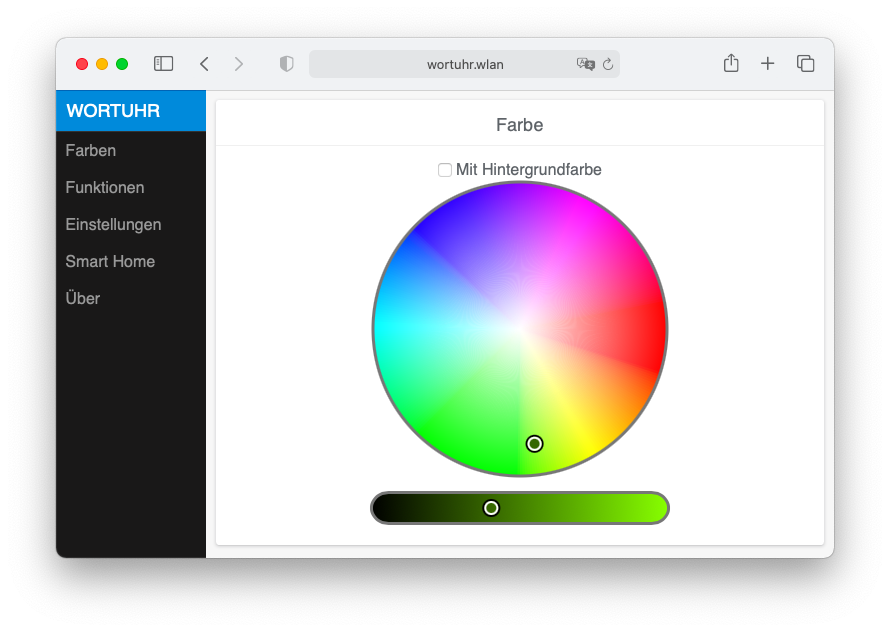

# WortUhr

Hier findet man alle nötigen Informationen zur Worduhr.



## Für den Nachbau wird folgende Hardware/Software benötigt:
* Hardware
    * NodeMCU (getestetes Board Lolin Version3) oder vergleichbares Board mit einem ESP8266 
    * WS2812B, WS2816 RGB LED Stripes oder SK6812 RGBW Stribes
    * Netzteil 5V 2A
    * Optional: LDR, 10 KOhm Widerstand
* Software
    * PlatformIO [Core](https://docs.platformio.org/en/latest/core/installation.html) oder [IDE](https://platformio.org/install/ide?install=vscode)
    * [Node.js](https://www.nodejs.org/)
    * [Git](https://git-scm.com)

## Installation 
### Windows

* PlatformIO IDE, Node.js und Git manuell über die Links oben installieren.
* Dadurch wird Visual Studio Code installiert, mit einem PlatformIO Symbol (Ameisenkopf/Alien) in der Seitenleiste
* Dort bei 'Quick Access / Miscellaneous' den Befehl 'Clone Git Project' aufrufen, und als URL 'https://github.com/ESPWortuhr/Wortuhr' eingeben
* Dann zu 'Projects', das neue Projekt per 'Add Existing' zu der Liste hinzufügen und dann auf 'Open' klicken
* Dann taucht in der PlatformIO Seitenleiste 'Project Tasks' auf. Dort den Befehl 'General / Upload' auswählen (dauert einige Minuten, die Software wird erst gebaut)
* Den ESP-8266 per USB anschließen. Wenn die Wortuhr Software fertig gebaut ist, wird sie anschließend auf dem ESP installiert.


### MacOS

Am einfachsten per [homebrew](https://docs.brew.sh/Installation):

```sh
brew install platformio
brew install node
git clone https://github.com/ESPWortuhr/Wortuhr
cd Wortuhr
pio run -t upload
```

### Linux

```sh
python3 -c "$(curl -fsSL https://raw.githubusercontent.com/platformio/platformio/master/scripts/get-platformio.py)"
sudo apt install npm
git clone https://github.com/ESPWortuhr/Wortuhr
cd Wortuhr
pio run -t upload
```

## Anschluss WS2812 oder SK6812 Stripe
* RX = DI / Data Bus
* G = GND / Masse
* VU = 5V
* Pegelanpassung 3,3V zu 5V siehe docs

## Anschluss LDR (optional)

      
## Verzeichnisstruktur

-   `pics` enthält Bilder
-   `svg` enthält SVG Dateien
-   `include` enthält C Header Dateien
-   `src` enthält C Source Dateien
-   `webpage` enthält das Webinterface
-   `docs` enthält Anleitungen

## To DO & (Ideen):
* Symbol zu einem bestimmten Datum/Uhrzeit
* Getrennte Helligkeitsregelung Hintergrundbeleuchtung/Anzeige 
* "The Matrix" effekt
* Minten Effekte
* HomeKit Support
* Alexa/GoogleHome Support
* HSI Farb Selektor auf der Website

## Known Bugs

* Bei > 60 Sekunden in der Sekundenanzeige wird die Uhrzeit nach Wechsel erst zur nächsten vollen Minute aktualisiert. 

### BSD-3 Lizenz

Diese Software steht unter der BSD-Lizenz und darf frei verwendet werden. Es ist erlaubt, sie zu kopieren, zu verändern und zu verbreiten.
Einzige Bedingung ist, dass der Copyright-Vermerk des ursprünglichen Programms nicht entfernt werden darf.
